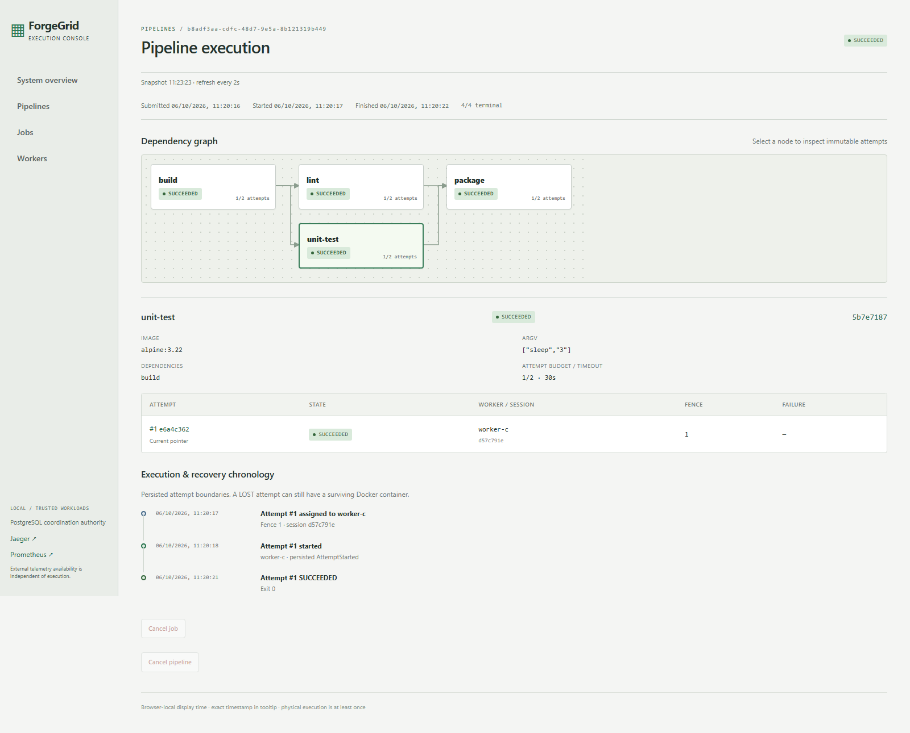
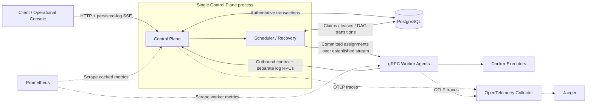

# ForgeGrid

**A distributed job execution engine with CI-style static DAG pipelines, built to make execution ownership and worker failure recovery explicit.**

Go · gRPC/Protobuf · PostgreSQL · Docker · React/TypeScript/Vite · OpenTelemetry · Prometheus · Jaeger

ForgeGrid coordinates outbound gRPC workers and executes argv commands in Docker. Its engineering focus is the interval between a worker disappearing and another worker acquiring authority: heartbeat loss does not transfer ownership, lease expiry does, and fencing prevents a delayed result from replacing the valid winner. PostgreSQL owns that decision; the browser and telemetry observe it.

This is a verified, trusted-local portfolio project, not a full GitHub Actions/GitLab replacement or a production-ready public deployment.

## Operational console



[Overview](docs/assets/console/overview.png) · [Workers](docs/assets/console/workers.png) · [Attempt/logs](docs/assets/console/attempt-logs.png) · [Recovery and both attempts](docs/assets/console/recovery.png) · [LOST attempt](docs/assets/console/attempt-lost.png). These are real local states, not fixtures; [capture provenance/reproduction](docs/screenshots.md).

## The signature recovery scenario

```text
worker-b runs attempt #1 / fence 1
  → worker-b disappears; heartbeats stop
  → session becomes OFFLINE; attempt still owns its unexpired lease
  → lease expires; attempt #1 becomes LOST
  → bounded retry creates attempt #2 / fence 2
  → worker-c executes and succeeds
  → delayed completion from attempt #1 is rejected as stale
```

The old attempt remains inspectable, including its worker session, fence, failure boundary and retained logs. The real Docker/browser test also verifies that the valid retry releases the dependent job. See the [recovery capture](docs/assets/console/recovery.png), [engineering audit](docs/final-engineering-audit.md) and [reproducible demos](#demos-and-verification).

## Correctness model

- **At-least-once physical execution:** crashes can leave an old Docker container alive; physical attempts can overlap. ForgeGrid does not fence external workload side effects.
- **One authoritative current attempt per job:** retries allocate a fresh UUID and greater fencing token. A current pointer can retain a terminal historical attempt without granting active authority.
- **Stale attempts cannot finalize a job:** completion checks attempt identity, fence, current pointer, active state, session and lease, independently of the recovery scanner.
- **Heartbeat and lease are separate:** liveness uses Control Plane receive time; workers renew authority only on successful ACKs and enforce conservative monotonic deadlines locally.
- **Bounded retries:** infrastructure loss may retry; nonzero workload exit, invalid executable and workload timeout do not automatically retry. `max_attempts` includes the first execution.
- **PostgreSQL is authoritative:** explicit transactions, row locks and constraints coordinate assignment, completion, capacity and DAG propagation. Dispatch follows the assignment commit.

## Architecture



Dashed paths are observation only. Collector, Jaeger or Prometheus outages do not grant leases, decide retries or block authoritative completion. [Tracing/metrics details](docs/observability-audit.md).

## Run locally

Requirements: Docker Engine/Desktop with Linux containers, Docker Compose v2, and Windows PowerShell 5.1 or PowerShell 7. Frontend verification/screenshots additionally use Node/npm (Node 24 verified) and Playwright Chromium. Go/protoc tooling runs in Docker; initial builds need internet access.

From the repository root:

```powershell
docker compose --profile console up -d --build --wait postgres control-plane worker-a worker-b worker-c console otel-collector prometheus jaeger
```

| Local surface | Address |
|---|---|
| Operational console | http://localhost:5173 |
| HTTP API / health / metrics | http://localhost:8080/api/v1/overview · http://localhost:8080/healthz · http://localhost:8080/metrics |
| Jaeger | http://localhost:16686 |
| Prometheus | http://localhost:9092 |
| PostgreSQL / worker gRPC | Loopback ports 5432 / 9090 |

These ports must be free. The Compose database password is a local development default. Agents access the Docker daemon; run only trusted workloads. There is no authentication/TLS.

Submit a standalone argv job:

```powershell
$body = @{ image = 'alpine:3.22'; command = @('echo', 'hello ForgeGrid'); timeout_seconds = 30; max_attempts = 2 } | ConvertTo-Json
$job = Invoke-RestMethod http://localhost:8080/api/v1/jobs -Method Post -ContentType application/json -Body $body
Invoke-RestMethod "http://localhost:8080/api/v1/jobs/$($job.id)"
```

Submit a static DAG at `/pipelines/new` in the console using its editable JSON example, or `POST /api/v1/pipelines`. Commands are argv arrays; a shell runs only if explicitly requested. Workload containers have no network, host mounts, Docker socket, privileged mode or host namespaces.

Stop services while retaining PostgreSQL data: `docker compose --profile console --profile tools down`. Do not use `down -v` unless intentionally deleting local state.

## Pipelines and operational console

Static DAG submissions validate unique keys, dependencies, self-edges and cycles before work becomes runnable. Roots queue immediately; children remain BLOCKED until every required parent succeeds. Fan-out branches execute concurrently when slots exist; fan-in releases transactionally. A retryable parent keeps children blocked. Permanent failure/exhaustion skips unresolved descendants transitively while unrelated branches continue.

Job/pipeline cancellation is durable; active reservations remain until a valid stop acknowledgement or lease expiry. Per-attempt timeouts exclude dependency/queue wait, include preparation/reporting, and cannot be extended by lease renewal. Pipelines finalize only after every job is terminal. [Exact precedence/transactions](docs/pipeline-semantics-audit.md).

The console provides health/capacity, pipeline/job lists, selectable DAGs, current/historical worker sessions, immutable attempt history, fences/deadlines, trace links, cancellation and persisted recovery chronology. Live stdout/stderr uses SSE with sequence-based resume and bounded browser memory. Refresh failures retain an explicitly stale snapshot; the UI never invents an offline timestamp or pretends LOST means physical shutdown. DRAINING is unsupported. [Console/API contract](docs/operational-console-audit.md).

## Demos and verification

Run demos/verification **sequentially and without other submissions**. Recovery scripts deliberately stop workers and restore them afterward; the frontend suite includes real worker failure.

| Command | What it proves |
|---|---|
| `./scripts/demo-normal.ps1` | Authoritative Docker success and both persisted output streams |
| `./scripts/demo-recovery.ps1` | worker-b → lease expiry → worker-c, higher fence and explicit stale-result rejection |
| `./scripts/demo-pipeline.ps1` | build → unit-test/lint in parallel → package; success and permanent failure/SKIPPED branch |
| `./scripts/demo-pipeline-recovery.ps1` | Dependent stays BLOCKED during loss/retry, then releases after valid success |
| `./scripts/demo-observability.ps1` | Actual normal/recovery Jaeger traces, current retry/expiry metric increments and scrape targets |
| `./scripts/verify.ps1` | Format, vet, build, uncached race-enabled unit/real PostgreSQL tests |
| `./scripts/verify-e2e.ps1` | Real Docker execution, protocol/log duplicates, DAGs, failures, timeout/cancellation |
| `./scripts/verify-recovery.ps1` | Real process crashes at selected commit/start windows; surviving containers/overlap |
| `./scripts/test-leaseguard.ps1` | Docker stop without renewal ACKs and Control Plane restart recovery |
| `./scripts/verify-observability.ps1` | Execution with telemetry absent at startup or lost mid-job |
| `./scripts/verify-frontend.ps1` | Strict TypeScript/build, components, browser fixtures and real Docker/browser recovery |

Integration tests create isolated PostgreSQL schemas. Trigger faults, advisory barriers and observed row-lock waits establish race/rollback ordering; mocks do not substitute for transactions. Browser fixtures complement real Docker recovery. [Complete release verification and dependency commands](docs/release-audit.md).

Development defaults: heartbeat 2s, offline threshold 6s, lease 10s, renewal 2s, capacity one per worker session. Retry backoff doubles from 1s to a 30s cap; `max_attempts` is 1–10. Timeout is 1–86,400s (default 30s). DAGs are limited to 128 jobs/2,048 edges.

For Vite development, stop the Compose console, then run `npm ci` and `npm run dev` in `frontend`. Regenerate committed Protobuf bindings with `./scripts/generate-proto.ps1`.

## Known limitations

- **Single Control Plane; no HA or scale guarantees.** Pipeline coordination is deliberately serialized. Sampling overhead grows with retained history.
- **Trusted local workloads only.** Agent Docker access is powerful; containers are not a hostile multi-tenant sandbox. No public deployment security claim.
- **No exactly-once physical execution or side-effect guarantee.** An inaccessible Docker daemon can leave an old container running; cleanup/cancellation cannot guarantee remote shutdown.
- **Logs/traces can be lost.** Bounded queues are not durable spools. Acknowledged logs persist, but crash/cancellation can lose pending chunks. No total log retention policy; local Jaeger is transient.
- Browser snapshots refresh periodically; exact offline history is unavailable. Offset pages can shift during submissions. Worker history is a bounded inspection window.
- Submission idempotency, DRAINING, dynamic/matrix DAGs, fail-fast, expressions, artifacts, authentication, secrets and integrations are not implemented.

## Engineering reference

| Document | Purpose |
|---|---|
| [Architecture v0.1](docs/architecture-v0.1.md) | Original design/invariants; conceptual scope is marked |
| [Implementation decisions](docs/implementation-v0.1.md) | Historical milestone decisions |
| [Execution](docs/execution-semantics.md) / [Failure model](docs/failure-model.md) / [Protocol](docs/protocol.md) | Implemented coordination/transport |
| [Correctness](docs/correctness-audit.md) / [Pipelines](docs/pipeline-semantics-audit.md) | Races and deterministic evidence |
| [Observability](docs/observability-audit.md) / [Console](docs/operational-console-audit.md) | Observation boundaries/tests |
| [Final engineering audit](docs/final-engineering-audit.md) / [Release audit](docs/release-audit.md) | Findings, limitations and verification |
| [v1.0.0 release notes](docs/releases/v1.0.0.md) / [Portfolio/interview notes](docs/portfolio.md) | Release scope and factual project explanation |
| [MIT license](LICENSE) / [Dependency notices](docs/licensing.md) | Licensing |

Code: `cmd/` entry points; `internal/controlplane`, `internal/store/postgres`, `internal/domain` coordination; `internal/worker` execution/guard; `internal/observability` traces/metrics; `api/proto` and `gen/go` contracts; `db/migrations` SQL; `frontend` console; `tests` and `scripts` verification.
